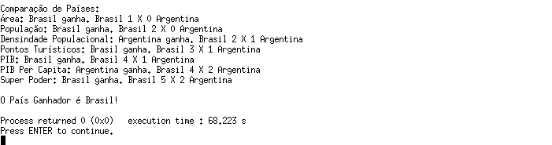

<h1>Cadastro de Cartas Países Nivel Mestre</h1>
 
Este projeto foi desenvolvido como parte de um trabalho acadêmico, utilizando linguagem C na IDE Code::Blocks.
 
O objetivo principal é criar um programa que permita cadastrar duas cartas de países, inserir informações relevantes sobre cada um e, ao final, compará-los para determinar o vencedor.
 

